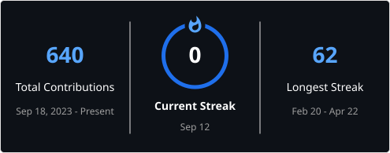

# Mariam Hussein

### Technical Sales & Customer Solutions | AWS Certified Cloud Practitioner | Front-End Web Development

Toronto-based technology and customer-solutions professional connecting customer needs with clear technical guidance and practical digital solutions.

[GitHub Profile](https://github.com/MariamHussei)

## About Me

- Based in **Toronto, Ontario, Canada**.
- Earned a **BSc Psychology** from the **University of Alberta**.
- **AWS Certified Cloud Practitioner** with foundational cloud knowledge.
- Experienced across technical sales, CRM, customer support, entrepreneurship, and business development.
- Building responsive front-end applications with **HTML, CSS, and JavaScript**.

## Core Strengths

**Technical Communication** · **Customer Discovery** · **Consultative Selling** · **CRM & Pipeline Management** · **Front-End Development** · **Cloud Fundamentals**

## Skills & Tools

### Front-End

  
  
  
  

<code>DOM Manipulation</code> · <code>Form Validation</code> · <code>Responsive Layouts</code> · <code>Accessible UI Components</code>

### Tools & Platforms

  
  
  
  
  
  

## Featured Projects

### [Personal Portfolio Website](https://github.com/MariamHussei/Personal-Portfolio-Website)

A complete responsive portfolio with semantic sections, active navigation, accessible form validation, and original local artwork.

`HTML5` · `CSS3` · `JavaScript`

**[Source Code](https://github.com/MariamHussei/Personal-Portfolio-Website)**

### [Age Calculator App](https://github.com/MariamHussei/Age-Calculator-App)

A calendar-aware calculator with birthdate validation, future-date protection, accessible results, and reset behavior.

`HTML5` · `CSS3` · `JavaScript`

**[Source Code](https://github.com/MariamHussei/Age-Calculator-App)**

### [Responsive Image Grid Gallery](https://github.com/MariamHussei/Responsive-Image-Grid-Gallery)

A responsive CSS Grid gallery with original architectural illustrations, accessible captions, and a keyboard-controlled lightbox.

`HTML5` · `CSS3` · `JavaScript`

**[Source Code](https://github.com/MariamHussei/Responsive-Image-Grid-Gallery)**

### [Responsive Pricing Cards](https://github.com/MariamHussei/Responsive-Pricing-Cards)

A responsive three-plan pricing interface with visual hierarchy, monthly/yearly price switching, and enquiry-form prefill behavior.

`HTML5` · `CSS3` · `JavaScript`

**[Source Code](https://github.com/MariamHussei/Responsive-Pricing-Cards)**

### [Interactive Accordion](https://github.com/MariamHussei/Interactive-Accordion)

An accessible FAQ component with coordinated panel states, reduced-motion support, ARIA attributes, and complete keyboard navigation.

`HTML5` · `CSS3` · `JavaScript`

**[Source Code](https://github.com/MariamHussei/Interactive-Accordion)**

### [Interactive Tabs Component](https://github.com/MariamHussei/Interactive-Tabs-Component)

A reusable product-information component with synchronized focus and selection states, dynamic content, and accessible keyboard controls.

`HTML5` · `CSS3` · `JavaScript`

**[Source Code](https://github.com/MariamHussei/Interactive-Tabs-Component)**

## Professional Experience

### Owner & Sales Lead — Independent Dessert Catering

_January 2025 – May 2026_

- Prospected **40+ local businesses monthly**, closed approximately **15–20 new contracts per quarter**, and achieved approximately **85% close rate on qualified leads**.
- Maintained approximately **70% client retention** and grew repeat business by approximately **25% in the first year**.

### Technical Sales Support Specialist — Apple

_October 2024 – April 2025_

- Resolved iOS and macOS customer issues with approximately **98% first-contact resolution**, connecting technical support with clear product recommendations.
- Conducted **20+ outbound calls daily**, delivered **30+ monthly product demonstrations**, and achieved approximately **110% of average monthly sales quota**.

### Sales Associate — H&M

_April 2020 – May 2023_

- Supported high-volume customer service, membership conversion, and team-member onboarding.

### Sales Associate — Staples

_January 2018 – December 2020_

- Guided customers through technology products, warranties, demonstrations, and purchase decisions.

## Education & Certification

- **University of Alberta** — BSc Psychology
- **AWS Certified Cloud Practitioner** — July 2024
- **Women in Sales Cohort (WIS)** — September 2025
- **Toastmasters Club member** — ongoing public-speaking and communication development

## GitHub Achievements

  

## GitHub Analytics

  
  

The language card reflects the composition of public repositories, not a measure of expertise.

### Contribution Streak

  

### Recent Contribution Activity

  

## Let's Connect

- **GitHub:** [github.com/MariamHussei](https://github.com/MariamHussei)
- **Location:** Toronto, Ontario, Canada
